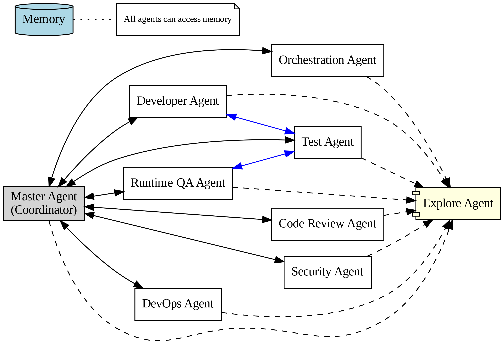

# ForgeLoop - Your Autonomous AI Coding Partner

ForgeLoop is an autonomous multi-agent AI coding system that builds, tests, and improves apps end-to-end with minimal input. Once given a direction, swarms of agents continue working independently until the task is done — including proper real-user-style testing and iteration.




---

## 🤖 Agents

1. **Orchestration Agent**: Designs software architecture, creates implementation plans, and generates detailed TODO lists for developers.
2. **Developer Agent**: Implements features, writes code, and coordinates with the test agent to ensure functionality.
3. **Test Agent**: Creates and runs comprehensive tests to validate code quality and reliability.
4. **Runtime QA Agent**: Runs the application in an isolated environment, validates real user flows, and coordinates fixes with other agents.
5. **Explore Agent**: Quickly searches and analyzes codebases to answer questions or locate specific patterns.
6. **Code Review Agent**: Reviews code for adherence to best practices, readability, and maintainability.
7. **Security Agent**: Identifies and mitigates security vulnerabilities in the code.
8. **DevOps Agent**: Automates deployment pipelines, monitors infrastructure, and ensures smooth operations.

---

## 🧠 Memory

ForgeLoop uses a Retrieval-Augmented Generation (RAG) approach to manage memory efficiently, ensuring relevant context is always available.

---

## 🛠️ Installation

ForgeLoop offers two installation methods:

1. **Install from Remote Repository**:
   ```bash
   bash install
   ```

2. **Install from Local Repository**:
   ```bash
   bash install --local
   ```
   
---

## 📝 Acknowledgments

This project was inspired by and built upon the foundations of OpenCode. Special thanks to the OpenCode community for their contributions and innovation.

https://opencode.ai