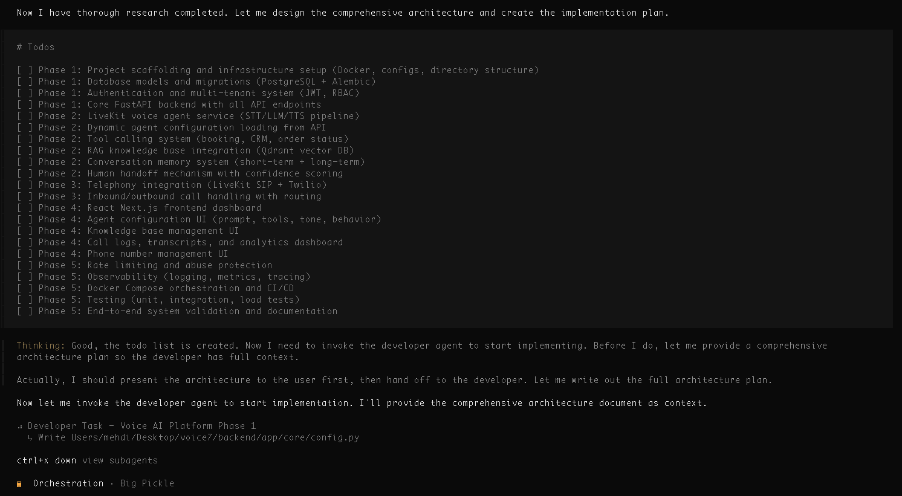

# DeepRise - Long-running coding agent that gets sh*t done

DeepRise is an autonomous multi-agent AI coding system that builds, tests, and improves apps end-to-end with minimal input. Once given a direction, swarms of agents continue working independently until the task is done — including proper real-user-style testing and iteration.




---

## 🤖 Agents

1. **Super Agent**: Acts as the CEO of the agent swarm — coordinates all other agents, receives and consolidates their feedback, sets strategies, and instructs each agent on what to do to drive the project forward.
2. **Orchestration Agent**: Designs software architecture, creates implementation plans, and generates detailed TODO lists for developers.
3. **Developer Agent**: Implements features, writes code, and coordinates with the test agent to ensure functionality.
4. **Test Agent**: Creates and runs comprehensive tests to validate code quality and reliability.
5. **User-Level Test Agent**: Simulates real-world user interactions to identify issues like a real human user.
6. **Runtime QA Agent**: Runs the application in an isolated environment, validates real user flows, and coordinates fixes with other agents.
7. **Explore Agent**: Searches and analyzes codebases to answer questions or locate specific patterns.
8. **Code Review Agent**: Reviews code for adherence to best practices, readability, and maintainability.
9. **Security Agent**: Identifies and mitigates security vulnerabilities in the code.
10. **DevOps Agent**: Automates deployment pipelines, monitors infrastructure, pushes to github, and ensures smooth operations.

---

## 🧠 Memory

DeepRise uses a Retrieval-Augmented Generation (RAG) approach to manage memory efficiently, ensuring relevant context is always available.

---

## 🛠️ Installation

```bash
git clone https://github.com/MehdiGhorb/deeprise.git
cd deeprise
```

Two installation methods:

1. **Install from Remote Repository**:
   ```bash
   bash install
   ```

2. **Install from Local Repository**:
   ```bash
   bash install --local
   ```
   
---

## 📝 Acknowledgments

This project was inspired by and built upon the foundations of OpenCode. Special thanks to the OpenCode community for their contributions and innovation.

https://opencode.ai